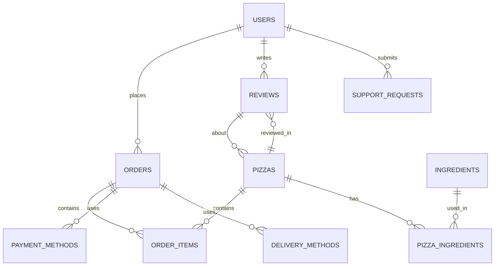

# ER DIAGRAMMA - O! PICA

## Grafiskā reprezentācija



## Detalizēta tabulu relāciju apraksts

### USERS (Lietotāji)
- **Primārais atslēga:** user_id
- **Saites uz:**
  - ORDERS (1:N) - Lietotājs var veikt vairākus pasūtījumus
  - REVIEWS (1:N) - Lietotājs var rakstīt vairākas atsauksmes
  - SUPPORT_REQUESTS (1:N) - Lietotājs var sūtīt apbalsta pieprasījumus

### PIZZAS (Picu katalogs)
- **Primārais atslēga:** pizza_id
- **Saites uz:**
  - PIZZA_INGREDIENTS (1:N) - Viena pica var saturēt vairākas sastāvdaļas
  - ORDER_ITEMS (1:N) - Viena pica var būt vairākos pasūtījumos
  - REVIEWS (1:N) - Viena pica var saņemt vairākas atsauksmes

### INGREDIENTS (Sastāvdaļas)
- **Primārais atslēga:** ingredient_id
- **Saites uz:**
  - PIZZA_INGREDIENTS (1:N) - Viena sastāvdaļa var būt vairākās picās

### PIZZA_INGREDIENTS (Picas sastāvs)
- **Primārās atslēgas:** pizza_id + ingredient_id (Composite Key)
- **Ārējās atslēgas:**
  - pizza_id -> PIZZAS
  - ingredient_id -> INGREDIENTS

### ORDERS (Pasūtījumi)
- **Primārais atslēga:** order_id
- **Ārējās atslēgas:**
  - user_id -> USERS (nullable)
  - payment_method_id -> PAYMENT_METHODS
  - delivery_method_id -> DELIVERY_METHODS
- **Saites uz:**
  - ORDER_ITEMS (1:N) - Viens pasūtījums var saturēt vairākas pozīcijas

### ORDER_ITEMS (Pasūtījuma pozīcijas)
- **Primārais atslēga:** order_item_id
- **Ārējās atslēgas:**
  - order_id → ORDERS
  - pizza_id → PIZZAS

### PAYMENT_METHODS (Maksāšanas metodes)
- **Primārais atslēga:** payment_method_id
- **Dati:**
  - 1: Maksāšana ar karti (💳)
  - 2: Maksāšana uz vietas (💵)
- **Saites uz:**
  - ORDERS (1:N) - Viena maksāšanas metode var būt vairākos pasūtījumos

### DELIVERY_METHODS (Piegādes metodes)
- **Primārais atslēga:** delivery_method_id
- **Dati:**
  - 1: Piegāde Tukumā (2.00 EUR)
  - 2: Savākšana pie Mego (0.00 EUR)
  - 3: Piegāde Jauntukumā, Durbē (1.00 EUR)
- **Saites uz:**
  - ORDERS (1:N) - Viena piegādes metode var būt vairākos pasūtījumos

### REVIEWS (Atsauksmes)
- **Primārais atslēga:** review_id
- **Ārējās atslēgas:**
  - user_id → USERS (nullable)
  - order_id → ORDERS (nullable)
  - pizza_id → PIZZAS

### SUPPORT_REQUESTS (Atbalsta pieprasījumi)
- **Primārais atslēga:** support_id
- **Ārējā atslēga:**
  - user_id → USERS (nullable)

## Normalizācija

Datu bāze ir normalizēta līdz **3NF (Third Normal Form)**:

✅ **1NF** - Visi atribūti ir atomāri (bez atkārtojošiem grupām)
✅ **2NF** - Visi atribūti ir pilnībā atkarīgi no primārās atslēgas
✅ **3NF** - Nav tranzitīvu atkarību starp atribūtiem

## Darbības shēma

```
USERS (customers)
  ├── places ORDERS
  │     ├── contains ORDER_ITEMS
  │     │     ├── references PIZZAS
  │     │     └── has pricing info
  │     ├── uses PAYMENT_METHODS
  │     └── uses DELIVERY_METHODS
  ├── writes REVIEWS
  │     └── about PIZZAS
  └── submits SUPPORT_REQUESTS

PIZZAS (menu items)
  ├── contains PIZZA_INGREDIENTS
  │     └── uses INGREDIENTS
  ├── appear in ORDER_ITEMS
  └── receive REVIEWS
```
